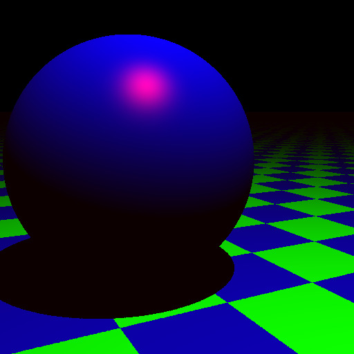
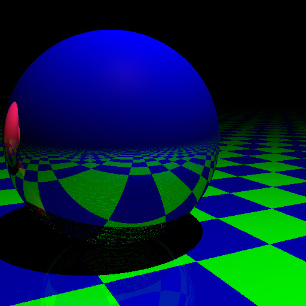

# Rendering

## A Step-By-Step Introduction to Rendering

The very first step for in any application of the ray tracer is to define the scene
parameters. This refers to

1. Screen Size: We are defining it as a named tuple but it can be anything you wish.
   ```julia
   screen_size = (w = 512, h = 512)
   ```

2. Light Source(s): We can either define a single light source or a vector of light
   sources. Depending on the input the raytracer dispatches to the correct function.
   ```julia
   light = PointLight(Vec3(1.0f0), 20000.0f0, Vec3(1.0f0, 5.0f0, -1.0f0))
   ```

3. Configuration of the Camera
   ```julia
   cam = Camera(Vec3(0.0f0, 0.35f0, -1.0f0), Vec3(1.0f0, 0.0f0, 1.0f0), Vec3(0.0f0, 1.0f0, 0.0f0),
                45.0f0, 1.0f0, screen_size.w, screen_size.h)
   
   origin, direction = get_primary_rays(cam)
   ```
   
4. (Most Importantly) The Objects present in the Scene
   ```julia
   scene = [
       SimpleSphere(Vec3(0.75f0, 0.1f0, 1.0f0), 0.6f0, color = rgb(0.0f0, 0.0f0, 1.0f0)),
       SimpleSphere(Vec3(-0.75f0, 0.1f0, 2.25f0), 0.6f0, color = rgb(0.5f0, 0.223f0, 0.5f0)),
       SimpleSphere(Vec3(-2.75f0, 0.1f0, 3.5f0), 0.6f0, color = rgb(1.0f0, 0.572f0, 0.184f0)),
       CheckeredSphere(Vec3(0.0f0, -99999.5f0, 0.0f0), 99999.0f0,
                       color1 = rgb(0.0f0, 1.0f0, 0.0f0),
                       color2 = rgb(0.0f0, 0.0f0, 1.0f0), reflection = 0.25f0)
   ]
   ```

For understanding what every single parameter means refer to the API Documentation.
Now that we have defined the entire 3D scene, we need to render it. Currently we
support only the blinn phong rendering model. In the next step there is nothing much
to configure. The only configurable option is whether we want to have global
illumination or not.

Firstly let us try to see the image **without** global illumination. For this we simply
pass the last paramter to `raytrace` function as any number `>= 2`.

```julia
color_no_gillum = raytrace(origin, direction, scene, light, origin, 2)

img_no_gillum = get_image(color_no_gillum, screen_size...)
```

The generated image should look like this:



Next generate the image **with** global illumination.

```julia
color_gillum = raytrace(origin, direction, scene, light, origin, 0)

img_gillum = get_image(color_gillum, screen_size...)
```

The generated image should look like this:



## Complete Script

```julia
using RayTracer, Images

screen_size = (w = 512, h = 512)

light = PointLight(Vec3(1.0f0), 20000.0f0, Vec3(1.0f0, 5.0f0, -1.0f0))

cam = Camera(Vec3(0.0f0, 0.35f0, -1.0f0), Vec3(1.0f0, 0.0f0, 1.0f0), Vec3(0.0f0, 1.0f0, 0.0f0),
             45.0f0, 1.0f0, screen_size.w, screen_size.h)

scene = [
    SimpleSphere(Vec3(0.75f0, 0.1f0, 1.0f0), 0.6f0, color = rgb(0.0f0, 0.0f0, 1.0f0)),
    SimpleSphere(Vec3(-0.75f0, 0.1f0, 2.25f0), 0.6f0, color = rgb(0.5f0, 0.223f0, 0.5f0)),
    SimpleSphere(Vec3(-2.75f0, 0.1f0, 3.5f0), 0.6f0, color = rgb(1.0f0, 0.572f0, 0.184f0)),
    CheckeredSphere(Vec3(0.0f0, -99999.5f0, 0.0f0), 99999.0f0,
                    color1 = rgb(0.0f0, 1.0f0, 0.0f0),
                    color2 = rgb(0.0f0, 0.0f0, 1.0f0), reflection = 0.25f0)
    ]

origin, direction = get_primary_rays(cam)

color = raytrace(origin, direction, scene, light, origin, 0)

img = get_image(color, screen_size.w, screen_size.h)

save("spheres1.jpg", img)
```

## Next Steps

* Look into the various objects supported by RayTracer
* Go to the `examples/rendering` directory for more examples
* Try out the *inverse rendering* examples (after all that is what this library is designed
  to do).
